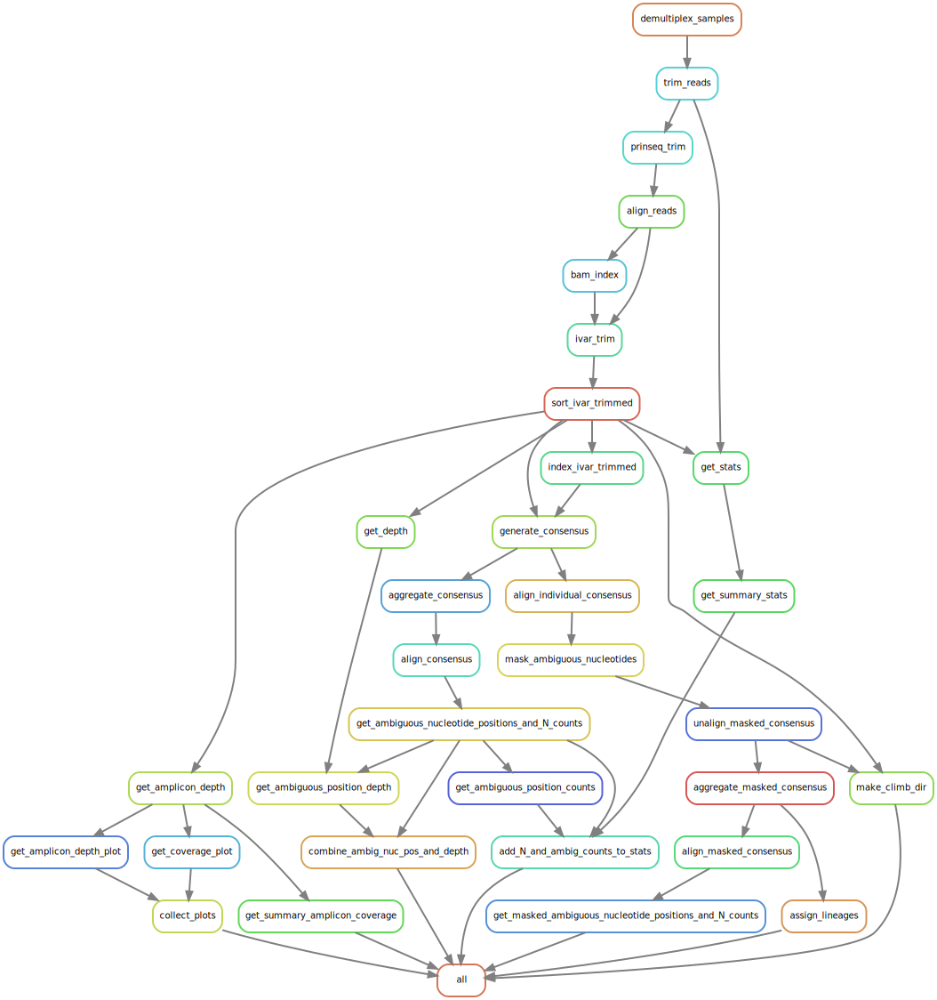

# nimagen_snakemake
A nimagen workflow implemented in snakemake.

## Install
```
git clone git@github.com:TriassicSalamander/nimagen_snakemake.git
cd nimagen_snakemake
mamba env create -f environment.yml
mamba create --name pangolin --channel conda-forge pangolin
conda activate nimagen_snakemake
```

## Creating Environments
It is recommended to use mamba (https://github.com/mamba-org/mamba) to create the environment, rather than conda.<br/>
Mamba can be installed by:
```
conda install mamba -n base -c conda-forge
```

## Processing Waste Water Samples
Currently, whether or not freyja is used in the pipeline is controlled by commenting/uncommenting the 'Freyja Outputs' in 'rule all' in the Snakefile. <br/>
See comments in Snakefile for more detail.


## Using autoNimagen
autoNimagen.sh is a wrapper which automatically executes the snakemake pipeline once the sequencing run is complete.
This is useful when you know the output path of a given sequencing run, but don't know exactly when the run will finish.<br/>
Usage:
```
bash autoNimagen.sh -i <path/to/run/directory> -c <number of cores>
```


## Pipeline Overview
### Read Alignment
The pipeline begins by demultiplexing the samples using bcl-convert, generating fastqs. <br/>
These fastqs are then quality trimmed using TrimGalore. <br/>
Prinseq is used to trim bases with quality <30 from the 3' end. <br/>
The reads are aligned to a reference using bwa mem. <br/>
The primers are trimmed from the reads using ivar trim. <br/>
The consensus is generated from the aligned reads using ivar consensus. <br/>


### Config Notes


## Rulegraph

